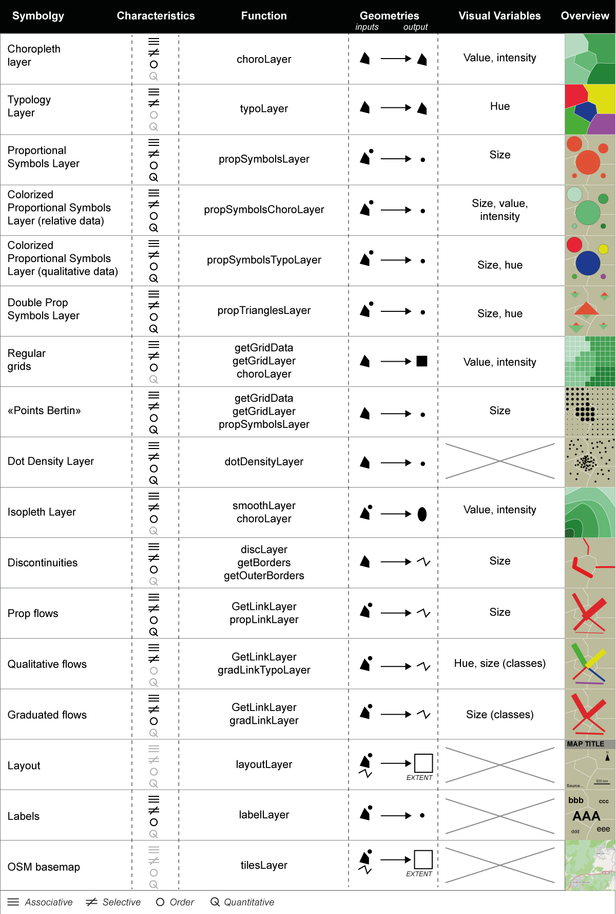
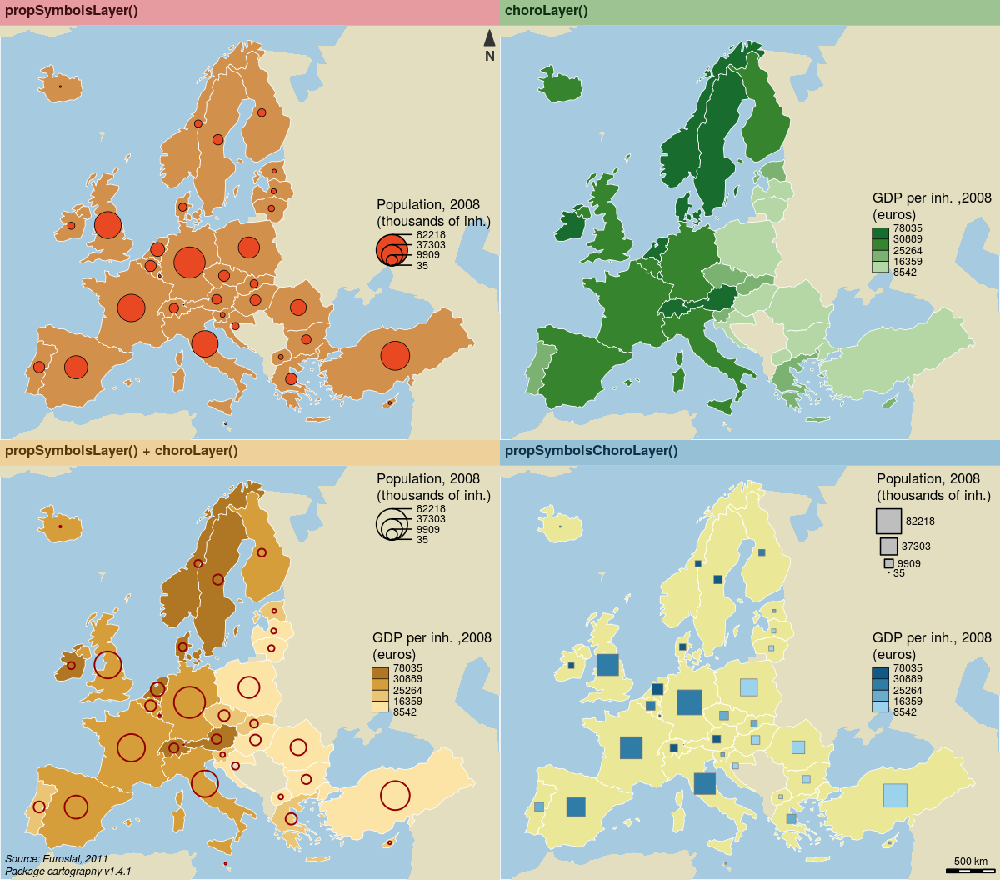

```{r setup, include=FALSE}
knitr::opts_chunk$set(echo = TRUE)
```

```{r knitr_init, echo=FALSE, cache=FALSE}
library(knitr)
## Global options
options(max.print="75")
opts_chunk$set(echo=TRUE,
	             cache=FALSE,
               prompt=FALSE,
               tidy=TRUE,
               comment=NA,
               message=FALSE,
               warning=FALSE, 
               fig.width=7)
opts_knit$set(width=75)
```

# Reproducible Cartography

**Timothée Giraud & Nicolas Lambert**

*Abstract*: The framework of this paper is the production of statistical maps fol-lowing the reproducible research paradigm. To produce statistical maps, the current or at least the most widespread usage is to combine several software products in a complex toolchain that use a variety of data and file formats. This software and formats diversity make it difficult to reproduce analysis and maps from A to Z. The aim of this paper is to propose a unified workflow that fully integrates map production in a reproducible process. We propose hereby a solution based on the R software through the development of the `cartography` package, an extension that fills the need of specific thematic mapping solution within the software.  

**Keywords:** Reproducibility, Open-source, R, Statistical cartography, Map workflow


## 1. Introduction 
Scientific claims have to be supported by evidences. The assessment of scientific results is possible through the availability of methods and data used by scientists and reproducibility is a key element to validate studies. The main idea behind reproducible research is to release studies with the data and the computer code that support their scientific claims [@peng_reproducible_2011].  

This idea has been firstly addressed by Jon Claerbout, a geophysicist that established a standard toolchain to produce (and reproduced) each figure made in his laboratory [@claerbout_electronic_1992]. The will to establish standards or develop the reproducibility is high in the reproducible research movement [@stodden_best_2013] and scientific journals are more and more considering to include datasets and code along articles they publish [@peng_reproducible_2009].  

Discussions about reproducible research mostly take place on computational or statistical science fields. We argue that maps, as other graphics or statistical outputs, are part of scientific studies and should be made reproducible as much as possible.  

To be considered as an evidence, a map should be open to debate and its construction should be made transparent. Yet, maps produced in an academic context are currently made with a set of software products (spreadsheet, statistical software, GIS…) that slices the cartographic process. This multiplicity of tools and formats is an impediment to reproducibility.  A fully reproducible map should be associated to the code and data used to produce it. Figure 1 describe what could be the spectrum of reproducibility for a map.      

  
**Fig. 1.  The spectrum of map reproducibility**

In this paper we propose a unified workflow that fully integrates map production in a reproducible process. This solution is based on the R software through the development of the cartography package, an extension that fills the need of specific thematic mapping solution within the software.  


## 2. From GUI to Script

### 2.1 A Step Backward?

Most of maps produced in an academic context are currently made with GIS or mapping applications that use graphical human-computer interaction. The use of graphical user interface (GUI) in computer sciences in general and cartography in particular is irrefutably a step toward more user-friendliness. But this step comes at the price of the growth of, if not impossible, at least difficult reproducible procedures. To circumvent this weak reproducibility ability, most applications provide languages to build maps in their framework (e.g. Model Builder for ArcGis or python to create scripts in QGIS). But these solutions do not easily cover the full workflow from raw data to graphic representation and statistical findings.

To solve this problem, one can use programming language that are explicitly build on the idea of keeping a trace of computations (data management, statistics, graphics and hence maps).

Moreover, we found three main advantages to advocate the use of theses scripting solutions. Firstly, the possibility to combine statistical operations before and after spatial operations within the same tool (i.e. unified toolchain). Building a map implies to implement a set of steps: data management, statistical analyses, geo-processing operations and eventually graphical display of results. Using two, three or more software products to conduct these operations introduces ruptures and a multiplication of data and file formats. Secondly, the ability to use literate programming reports (i.e. reproducibility). Literate programming, introduced by Donald Knuth [-@knuth_literate_1992], strongly links analyses, statistical outputs and the code used to produce them in a single document [^litt]. And, eventually, most of scripting languages are open-source and the use of open-source frameworks gives a full transparency on the methods and tools used to conduct analyses.

Scripting solutions can appear as a step back for cartographers that learn computed cartography with proprietary software languages (ARC Macro Language designed by ESRI in 1986, or SAS macros). We argue that, in the reproducible research framework, researchers have to use literate programming solutions that enable the full traceability of their studies.

A script that describes every steps of the process that goes from raw data to comprehensive vector thematic maps and including all statistical and geometrical transformation can be considered as a full metadata document. 

### 2.2 R as a Go-To Tool for Integrated Analysis

Several programming languages and software can be used to conduct studies in a unified workflow that integrates data handling, data processing including spatial analyses procedures and spatial representations. Among them python and R emerge as the most prominent ones.

Python appears to be more versatile than R which is more focused on data. Spatial libraries exist for these two languages but the R spatial ecosystem is more dynamic and includes more spatial analyses methods. We place ourselves in the statistical cartography field and we have decided to invest the R development since R fits our need to strongly connect statistics and cartography.  

R is both a language and an environment for statistical computing and graphics. A large part of this open-source software popularity is due to its plug-ins model. These plug-ins are called packages, they are created by users and distributed through public repositories (Comprehensive R Archive Network [^CRAN]). This system allows to develop and share software pieces in a transparent way.

Among its many packages some are dedicated to the management, modification and display of spatial features. Three main packages are unavoidable: sp [@pebesma_classes_2005; @bivand_applied_2013], rgdal [@bivand_rgdal:_2016] and rgeos [@bivand_rgeos:_2016]. sp allows to manage spatial data (vector and raster). To manipulate geographical projections and data import/export, rgdal provides bindings to the GDAL [^gdal] and PROJ.4 [^proj4] libraries. rgeos is an interface to the GEOS [^geos] library aiming at geo-processing spatial features.

Several packages already exist to produce thematic maps in R, most of them are described in the Visualisation topic of the “Analysis of Spatial Data” CRAN Task View [^task].  Nevertheless, none of them fits the need to have both easy mapping features, elegant design of functions, a complete set of cartographic layout element (arrow, scale, legends…) and a large set of representations.

With the cartography package we propose an extension of the R ecosystem that enables fully reproducible cartography along with data collection and data analysis. cartography is built upon and benefits from the development of two of the main spatial related packages (sp & rgeos).  

## 3. The cartography Package

### 3.1 Design
The aim of the cartography package is to obtain thematic maps with the visual quality of those build with other common mapping and GIS software.

Users of the package could belong to one of two categories: cartographers new to R programming or R users new to cartography. Therefore, its functions have to be intuitive to cartographers and ensure compatibility with common R workflows.

The package design follows some of the current usage in GIS workflows. Each function has two main arguments that are a spatial object (e.g. GIS: vector layer / R: sp object) and an attribute table (e.g. GIS: csv / R: data frame) linked by a common identifier. Each function focuses on a single cartographic representation (e.g. proportional symbols or choropleth representation) and display it on a georeferenced plot. This solution allows to consider each representation as a layer and to overlay multiple representations on a same map.


**Fig. 2.  Main features of cartography** 

Functions have many parameters to fine tune the cartographic representation. These parameters are the common ones found in GIS and automatic cartography software (e.g. width of the polygons boundaries or color palettes used in choropleth maps).

The choice was also made to display the cartographic layer with its customizable legend by default.

Along with the cartographic functions, some other functions are dedicated to layout design. A function allows to display a customizable scale bar, a north arrow, a title, sources or author information.

The common practice in R packages is to illustrate functions by working examples. Thus, each cartography's function is illustrated by a full example using the dataset (spatial and statistical datasets on European regions) provided in the package. New users can easily reproduce examples or adapt these scripts to their own dataset.

A large variety of export formats are available in R, in vector as well as in raster format. This allows to edit the final maps in common graphic design software. 

The package itself has already been peer reviewed and published in a journal for research software packages [@giraud_cartography:_2016]. This publication ensures the usability of the package in an academic context.

### 3.2 Main Features
cartography counts 35 functions that process and display spatial object or map layout elements. Figure 2 sums up the different possible maps produced with the package as well as the main function used to produce them. Common representations are provided as well as some more advanced maps that usually need geo-processing. The following figures are examples of cartography usage, scripts used to generate them are, of course, available in a public repository [^pub]. 

```{r, eval=FALSE }
library(cartography)

# Load data
data(nuts2006)

# get the figure ratio
sizes <- getFigDim(spdf = nuts0.spdf, width = 600, mar = c(0,0,1.2,0))
sizes[1] <- sizes[1] * 2
sizes[2] <- sizes[2] * 2

# save the maps in png format
png(filename = "img/4maps.png", width = sizes[1], height = sizes[2], res = 150)

# set margins
opar <- par(mar = c(0,0,1.2,0), mfrow = c(2,2))

# Plot a layer with the extent of the EU28 countries with only a background color
plot(nuts0.spdf, border = NA, col = NA, bg = "#A6CAE0")

# Plot non european space
plot(world.spdf, col = "#E3DEBF", border = NA, add = TRUE)

# plot countries
plot(nuts0.spdf, col = "#D1914D",border = "white", lwd=0.5, add=TRUE)

# transform to thousand of inhabitants
nuts0.df$pop <- nuts0.df$pop2008 / 1000

# Plot the population
propSymbolsLayer(spdf = nuts0.spdf, 
                 df = nuts0.df,  
                 inches = 0.125, lwd = 0.5, var = "pop",
                 legend.pos = "right", legend.values.rnd = 0, 
                 legend.title.txt = "Population, 2008\n(thousands of inh.)", 
                 legend.frame = F)
# Layout plot
layoutLayer(title = "propSymbolsLayer()",  author = "", 
            sources = "", frame = FALSE,  
            scale = NULL, theme = "wine.pal",
            north = TRUE) # add a south arrow


# compute the GDP per inhabitants
nuts0.df$gdpinh <- nuts0.df$gdppps2008 * 1000000 / nuts0.df$pop2008

# Plot a layer with the extent of the EU28 countries with only a background color
plot(nuts0.spdf, border = NA, col = NA, bg = "#A6CAE0")

# Plot non european space
plot(world.spdf, col  = "#E3DEBF", border=NA, add=TRUE)

# plot the gdp per inhabitant
choroLayer(spdf = nuts0.spdf, df = nuts0.df, var = "gdpinh", 
           col = carto.pal(pal1 = "green.pal", n1 = 4), 
           method = "quantile",nclass = 4,  border = "white", lwd = 0.5,  
           legend.pos = "right", legend.title.txt = "GDP per inh. ,2008\n(euros)", 
           add=T)

layoutLayer(title = "choroLayer()", author = "", 
            sources = "", frame = FALSE, 
            scale = NULL, theme = "green.pal",
            north = FALSE) 


# Plot a layer with the extent of the EU28 countries with only a background color
plot(nuts0.spdf, border = NA, col = NA, bg = "#A6CAE0")

# Plot non european space
plot(world.spdf, col  = "#E3DEBF", border=NA, add=TRUE)

# Plot the gdp per inhabitant
choroLayer(spdf = nuts0.spdf, df = nuts0.df, var = "gdpinh", 
           col = carto.pal(pal1 = "sand.pal", n1 = 4), 
           method = "quantile",nclass = 4,  border = "white", lwd = 0.5,  
           legend.pos = "right", legend.title.txt = "GDP per inh. ,2008\n(euros)", 
           add=T)

# Plot the population
propSymbolsLayer(spdf = nuts0.spdf, 
                 df = nuts0.df,  
                 inches = 0.125, lwd = 1.25, var = "pop", 
                 col = NA, border = "#940000", 
                 legend.pos = "topright", legend.values.rnd = 0, 
                 legend.title.txt = "Population, 2008\n(thousands of inh.)", 
                 legend.frame = F)

# layout
layoutLayer(title = "propSymbolsLayer() + choroLayer()", 
            author = "Package cartography v1.4.1", 
            sources = "Source: Eurostat, 2011",
            frame = FALSE, 
            scale = NULL, theme = "sand.pal",
            north = FALSE) 


# Plot a layer with the extent of the EU28 countries with only a background color
plot(nuts0.spdf, border = NA, col = NA, bg = "#A6CAE0")

# Plot non european space
plot(world.spdf, col  = "#E3DEBF", border=NA, add=TRUE)

# plot countries
plot(nuts0.spdf, col = "#F8FD4050",border = "white", lwd=0.5, add=TRUE)

# Plot symbols with choropleth coloration
propSymbolsChoroLayer(spdf = nuts0.spdf, 
                      df = nuts0.df, 
                      var = "pop", 
                      inches = 0.2, 
                      var2 = "gdpinh", 
                      col = carto.pal(pal1 = "blue.pal", n1 = 4),symbols = "square",
                      method = "quantile", 
                      nclass = 4, 
                      border = "grey50",  
                      lwd = 0.5, 
                      legend.var.pos = "topright",
                      legend.var.values.rnd = 0, 
                      legend.var.title.txt = "Population, 2008\n(thousands of inh.)", 
                      legend.var.style = "e",
                      legend.var2.pos = "right",
                      legend.var2.values.rnd = 0,
                      legend.var2.title.txt = "GDP per inh., 2008\n(euros)")


# layout
layoutLayer(title = "propSymbolsChoroLayer()", author = "", 
            sources = "", frame = FALSE,  theme = "blue.pal",
            scale = 500, 
            north = FALSE) 

dev.off()
```

   
**Fig. 3.  Four common maps** 

Figure 3 shows three maps produced with cartography. The first one dis-plays the amount of population by country in Europe by using the proportional symbols function (propSymbolsLayer). The second one display the gross domestic product per inhabitants in euros on a choropleth map (choroLayer). The third map combines two indicators, the symbols sizes are proportional to the total population and the color scale is based on the distribution of gross domestic product per inhabitant (propSymbolsChoroLayer). 

The three next maps need some geo-processing operation on geometries and data that are usually spread across multiple tasks (i.e. multiple files). cartography proposes to simplify the process by providing functions that wrap the multiple steps.

```{r, eval=FALSE }
library(cartography)
# Load data
data(nuts2006)

# Create a grid layer
mygrid <- getGridLayer(spdf = nuts3.spdf, cellsize = 100000, type = "hexagonal")

# Compute data for the grid layer
df1 <- getGridData(x = mygrid, df = nuts3.df, var = "pop2008" )
df2 <- getGridData(x = mygrid, df = nuts3.df, var = "pop1999" )

# Compute the compound annual growth rate
df1$cagr <-(((df1$pop2008 / df2$pop1999)^(1/9)) - 1) * 100
v <- getBreaks(v = df1$cagr ,method = "quantile",nclass = 10)
v[5] <- 0

# set a color palette
cols <- c("#f18b61","#f7b48c","#f3d9b7","#f1eccd","#c0dec2",
          "#91caa4","#63b285","#329966","#26734d","#1a4c33")

# get the figure ratio
sizes <- getFigDim(spdf = nuts0.spdf, width = 1200, mar = c(0,0,1.2,0))

# save the map in png format
png(filename = "img/RegularGrid.png", width = sizes[1], height = sizes[2],res = 150)

# set margins
opar <- par(mar = c(0,0,1.2,0), mfrow = c(1,1))

# Plot a layer with the extent of the EU28 countries with only a background color
plot(nuts0.spdf, border = NA, col = NA, bg = "#A6CAE0")

# Plot non european space
plot(world.spdf, col  = "#CCCCCC", border=NA, add=TRUE)

# plot the choropleth grid
choroLayer(spdf = mygrid$spdf,df = df1,var = "cagr", add=TRUE,
           col=cols, lwd = 0.6, border = "#FFFFFF60",
           legend.pos = "right", breaks = v,legend.values.rnd = 2,
           legend.title.txt = "Compound Annual\nGrowth Rate")

# plot countries boundaries
plot(nuts0.spdf, add=T, col = NA, border = "#56514c", lwd = 0.7)

# Plot a layout
layoutLayer(title = "Demographic Trends, 1999-2008", 
            author = "Package cartography v1.4.0", 
            sources = "Source: Eurostat, 2011", frame = TRUE, 
            scale = 500, 
            north = TRUE, theme = "taupe.pal") 
dev.off()
```

**Fig. 4. Gridded map**

The grid-cell method is an option to overcome the arbitrariness and irregularity of administrative division. It highlights the main trends in the data spatial distribution, splitting the territory in regular blocks. Statistical values are distributed over a regular grid. Cell values are discretized and then displayed in areas of color. The principle adopted here is to set each cell's value with a proportion of the initial geometrical units it overlay (share of intersected area).

In cartography the map process relies on three functions. getGridLayer builds a regular grid (squares or hexagons) based on a spatial object and provide a table of surface intersections. getGridLayer computes data to match the grid layer according to the surface intersections. Eventually, choroLayer uses the grid and data to display a choropleth map (figure 4).  

```{r, eval=FALSE}
library(cartography)
# Load data
data(nuts2006)

# Get a SpatialLinesDataFrame of countries borders
nuts2.contig <- getBorders(nuts2.spdf)
nuts2.df$gdpcap <- nuts2.df$gdppps2008 / nuts2.df$pop2008 * 1000000

# set figure ratio
sizes <- getFigDim(spdf = nuts0.spdf, width = 1200, mar = c(0,0,1.2,0))

# save the map in png format
png(filename = "img/Discontinuities.png", width = sizes[1], height = sizes[2],res = 150)

# set margins
opar <- par(mar = c(0,0,1.2,0))

# Plot a layer with the extent of the EU28 countries with only a background color
plot(nuts2.spdf, border = NA, col = NA, bg = "#A6CAE0")
# Plot non european space
plot(world.spdf, col  = "#E3DEBF", border=NA, add=TRUE)

# Plot GDP per capita with a choropleth layer
choroLayer(spdf = nuts2.spdf, df = nuts2.df, var = "gdpcap", border = "grey20", lwd = 0.2,
           col = carto.pal(pal1 = "green.pal", n1 = 3, "sand.pal", 3 ), method = "quantile",
           nclass = 6, add=TRUE, legend.pos = "right", 
           legend.values.rnd = -2,
           legend.title.txt = "GDP per Capita\n(in euros)")

# Plot discontinuities
discLayer(spdf = nuts2.contig,
          df = nuts2.df, 
          var = "gdpcap", 
          type = "rel", 
          method="equal", 
          nclass = 3, 
          threshold = 0.4, 
          sizemin = 0.7, 
          sizemax = 6, 
          col="red", 
          legend.values.rnd = 1,
          legend.title.txt = "Discontinuities in \nGDP per Capita\n(relative)",
          legend.pos = "topright", 
          add=TRUE)

# Layout
layoutLayer(title = "Wealth Disparities in Europe, 2008",
            author = "Package cartography v1.4.0", 
            sources = "Source: Eurostat, 2011", frame = TRUE, 
            scale = 500,  theme = "grey.pal")
dev.off()
```

**Fig. 5. Discontinuities map**

Discontinuities maps are based on the variation of a phenomena between contiguous administrative units. This kind of representation does not focus on homogeneous zones, but rather on spatial breaks. On the map, discontinuity intensity is expressed by the borders' thickness.

The first step to build these maps is to extracts borders between units. The second step is to compute a discontinuity measure (either a ratio or an absolute difference). The third step is to display it on a map using the size visual variable. Combine these discontinuities with a choropleth representation helps to understand the discontinuity direction (which one of two regions has the higher value).  

In cartography, getBorders is used to build a spatial object of borders between units. Each resulting borders contains the ids of its two neighboring units. It is also possible to complement these borders by the getOuterBorders function that can compute borders between non-contiguous units (maritime borders). discLayer function compute and display discontinuities, the line widths reflect the ratio or the absolute difference between values of an indicator in two neighboring units. Of course, the discontinuities layer can be associate with a choropleth layer (choroLayer) (figure 5).

```{r, eval=FALSE}
library(cartography)
# Load data
data(nuts2006)

# Create a grid layer
mygrid <- getGridLayer(spdf = nuts3.spdf, cellsize = 50000, type = "regular")

# transform gdp in euros
nuts3.df$gdp <- nuts3.df$gdppps2008 * 1000000

# Compute data for the grid layer
df1 <- getGridData(x = mygrid, df = nuts3.df, var = "pop2008" )
df2 <- getGridData(x = mygrid, df = nuts3.df, var = "gdp" )
df1$gdp <- df2$gdp

# list of breaks
v <- c(2920, 5000, 10000, 15000, 20000, 23500, 30000, 35000, 40000, 42720)

# figure ratio
sizes <- getFigDim(spdf = nuts0.spdf, width = 1200, mar = c(0,0,1.2,0))

# save the map to a png file
png(filename = "img/IsoplethMap.png", width = sizes[1], height = sizes[2], res = 150)

# set margins
opar <- par(mar = c(0,0,1.2,0))

# Plot a layer with the extent of the EU28 countries with only a background color
plot(nuts0.spdf, border = NA, col = NA, bg = "#A6CAE0")

# Plot non european space
plot(world.spdf, col  = "#E3DEBF", border=NA, add=TRUE)

# set a color palette
cols <- c(rev(carto.pal("green.pal", 5)), carto.pal("orange.pal", 4))

# compute & display the potential map
smoothLayer(spdf = mygrid$spdf, df = df1, var = "gdp", var2 = "pop2008", 
            breaks = v, span = 100000, beta = 2, mask = nuts0.spdf, 
            resolution = 49000, col=cols,
            legend.title.txt = "Potential\nGDP per capita\n(in euros)",
            legend.values.rnd = -2, border = "grey80", lwd = 0.5, add=T, 
            legend.pos = "topright")

# plot Europe contour
plot(rgeos::gBuffer(nuts0.spdf,FALSE , 1), add=T, col = NA, border = "grey50")

# plot a layout
layoutLayer(title = "Wealth Inequalities in Europe, 2008", 
            author = "Package cartography v1.4.0", 
            sources = "Source: Eurostat, 2011", frame = TRUE, 
            scale = 500, 
            north = FALSE, theme = "sand.pal") 

# plot a text on the map
text(x = 6271272, y = 3743765, 
     labels = "Distance function:\n- type = exponential\n- beta = 2\n- span = 100 km", 
     cex = 0.8, adj = 0, font = 3)

dev.off()
```

**Fig. 6. Isopleth map** 

Unlike choropleth maps, which represent data as discrete values, isopleth maps are based on the assumption that the phenomenon to be represented has a continuous distribution. These maps use a spatial interaction modeling approach which aims to compute indicators based on stock values weighted by distance [@stewart_measure_1942]. It allows a spatial representation of the phenomenon independent from the initial heterogeneity of the territorial division. The result is easy to read and can be considered as a bypassing of the Modifiable Areal Unit Problem (MAUP) [@openshaw_million_1979].

In cartography, the smoothLayer function, that heavily depends on the SpatialPosition [@giraud_spatialposition:_2016] package, allow to compute quickly these maps. The function takes as inputs a marked point layer and a set of parameters (a spatial interaction function and its parameters) and outputs an isopleth map layer (figure 6).

## 4. Conclusion
cartography was accepted on the CRAN on October 5, 2015 in its 1.0 version. It was updated 3 times in its first year (current version is 1.4.0). The development of the package take place publicly on the on-line version control system GitHub [^git]. As of October 23, 2016 the package has been downloaded 6,414 times from the RStudio CRAN [^stat]. This figure reveals an actual need of thematic mapping tools in reproducible research workflows.

Eventually, we argue that to obtain a full acknowledgement as scientific products, maps should tend to be more reproducible. R and the cartography package (among other possibilities) could be relevant tools to ensure reproducibility in the academic context, hence promoting transparent scientific debates.


```{r, echo = FALSE}
library(cartography)
```

```{r}
sessionInfo()
```


## References

[^litt]: For example, R Markdown and Jupyter notebooks are respectively R and Python literate pro-gramming solutions based on the Markdown markup language. 
[^CRAN]: Commonly referred to as CRAN. As of 24th of September 2016 the CRAN features 9387 packages.
[^gdal]: Geospatial Data Abstraction Library, a translator library for raster and vector geospatial data formats.
[^proj4]: Cartographic Projections Library.
[^geos]: Geometry Engine, Open Source, a geometrical operation library.
[^task]: CRAN Task Views are guides that group and describe packages of specific domains.
[^pub]: https://github.com/riatelab/ReproducibleCartography
[^git]: https://github.com/Groupe-ElementR/cartography
[^stat]: This number underestimates the global number of download. It is difficult to obtain statistics on the number of time a package has been downloaded. The CRAN is deployed across various mirror sites and only the RStudio's one allows to gather this information.


