```{r knitr_init, echo=FALSE, cache=FALSE}
library(knitr)
## Global options
options(max.print="90")
opts_chunk$set(echo=TRUE,
	             cache=TRUE,
               prompt=FALSE,
               tidy=FALSE,
               comment=NA,
               message=FALSE,
               warning=FALSE)
opts_knit$set(width=90)
options(width = 90)


```


# touche s pour faire apparaitre les notes dans une seconde fenêtre


# "Science is infallible; but scholars are always wrong."

<div class="notes">
"La science est infaillible ; mais les savants se trompent toujours" 
(Anatole France, 1889)   
</div>


## 


* Le principe de la reproductibilité est au fondement même des sciences    
* La reproductibilité est le meilleur test de la validité d'une expérimentation 
scientifique. 
* [CONSTAT] Par rapport aux sciences experimentales, Les sciences basées sur 
l'informatique ont l'avantage d'être plus facilement reproductibles.    
* [OBJECTIF] Accompagner les publications scientifiques des jeux de données et 
codes sources pour permettre aux collègues de reproduire les résultats.    
 
<div class="notes">
The assessment of scientific
results is possible through the availability of methods and data used by scientists,
and reproducibility is a key element to validate studies.
</div>
 
## The Reproducibility Spectrum


Peng, 2011

<div class="notes">
The main idea behind
reproducible research is to release studies along with data and computer code that
support scientific findings (Peng 2011).
</div>


## Map Reproducibility ?

* Maps are part of scientific studies and should be reproducible. 

<div class="notes">
We argue that maps, as other graphics or statistical outputs,
are part of scientific studies and should, as much as possible, be reproducible.
</div>


## Map Reproducibility ?

- Keep traces of computations   
- Share methods    
- Publish transparent studies
- Update easily  
- Work collectively  
- Automatize tasks
- Combine analysis and representations


## Map Reproducibility ?

Statistical maps production use a wide range of software products and data formats.

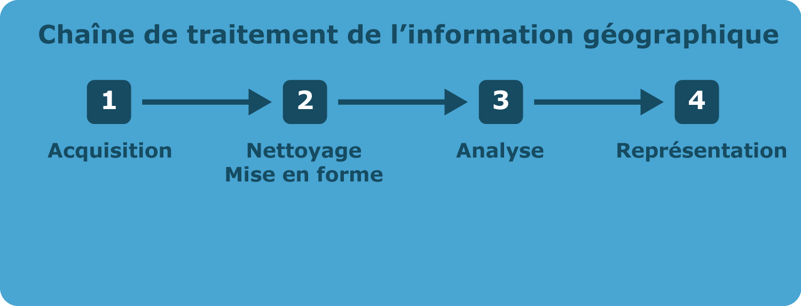


## Map Reproducibility ?

* This diversity makes reproducibility difficult

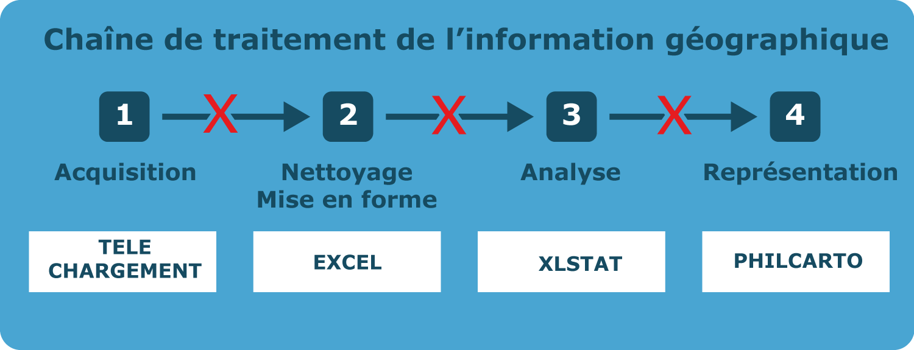


## Map Reproducibility ?

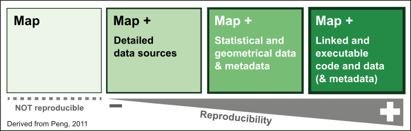

We need a single tool to simplify the toolchain and ensure an easy reproducibility. 

<div class="notes">
We argue that in the reproducible research framework, researchers
must use literate programming solutions that enable the full traceability of their
studies. A script that describes every step of the process, from raw data to com-
prehensive vector thematic maps that includes all statistical and geometrical
transformations, is considered a full metadata document.
</div>

# HOW ?

## Pick an appropriate tool

* Availability - cost
* Transparency - Open-source
* Simplicity - access to functionnalities and help

## Pick an appropriate tool

__The R Software__:   
<p style="text-align: left;">
R is a free software environment for statistical computing and graphics. 
It compiles and runs on a wide variety of UNIX platforms, Windows and MacOS.</p>

<div class="notes">
* Open Source (GNU General Public License)
* Initially design for statistics But a large number of packages are dedicated to 
spatial information management. 
</div>


## Pick an appropriate tool

R has:  

- A large ecosystem of user-contributed extensions (packages)  

- A pretty IDE (RStudio)  

- Very good literate programming functionnalities (rmarkdown)  

<div class="notes">
10762 packages in the *Comprehensive R Archive Network* (CRAN) (6 juin 2017)  
</div>

## From a complex toolchain...


## ... to an unified workflow

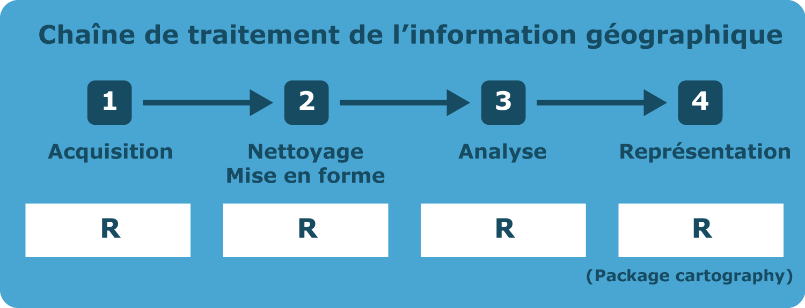


# cartography


## Some simple maps

<small>
```{r propS, echo=TRUE, eval=FALSE, prompt=FALSE, message=FALSE, results='hide'}
library(cartography)
# Load data
data(nuts2006)
# save map
png(filename = "img/map1.png", width = 600, height = 535, res = 100)
par(mar = c(0,0,1.2,0))
# Plot a background layers
plot(nuts0.spdf, border = NA, col = NA, bg = "#A6CAE0")
plot(world.spdf, col = "#E3DEBF", border = NA, add = TRUE)
plot(nuts0.spdf, col = "#D1914D", border = "white", lwd = 0.5, 
     add = TRUE)
# transform to thousand of inhabitants
nuts0.df$pop <- nuts0.df$pop2008/1000
# Plot the population
propSymbolsLayer(spdf = nuts0.spdf, df = nuts0.df, 
                 inches = 0.2, lwd = 0.5, 
                 var = "pop", legend.pos = "right", 
                 legend.values.rnd = 0, 
                 legend.title.txt = 
                   "Population, 2008\n(thousands of inh.)", 
                 legend.frame = F)
# Layout plot
layoutLayer(title = "propSymbolsLayer()",
            author = "Package cartography v1.4.2", 
            sources = "Source: Eurostat, 2011", 
            frame = FALSE, scale = NULL, theme = "wine.pal", 
            north = TRUE)  
dev.off()


#                                                                                                         .
```
</small>


## Some simple maps

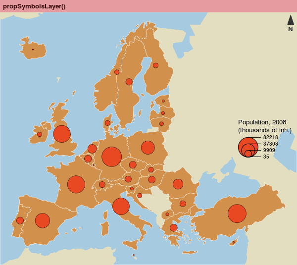

## Some simple maps
<small>
```{r choro, echo=TRUE, eval=FALSE, prompt=FALSE, message=FALSE, results='hide'}
# save map
png(filename = "img/map2.png", width = 600, height = 535, res = 100)
par(mar = c(0,0,1.2,0))
# compute the GDP per inhabitants
nuts0.df$gdpinh <- nuts0.df$gdppps2008 * 1e+06/nuts0.df$pop2008
# Plot a background layers
plot(nuts0.spdf, border = NA, col = NA, bg = "#A6CAE0")
plot(world.spdf, col = "#E3DEBF", border = NA, add = TRUE)

# plot the gdp per inhabitant
choroLayer(spdf = nuts0.spdf, df = nuts0.df, var = "gdpinh", 
           col = carto.pal(pal1 = "green.pal", n1 = 4), 
           method = "quantile", nclass = 4, border = "white", 
           lwd = 0.5, legend.pos = "right", 
           legend.title.txt = "GDP per inh., 2008\n(euros)", add = T)

layoutLayer(title = "choroLayer()",
            author = "Package cartography v1.4.2", 
            sources = "Source: Eurostat, 2011", 
            frame = FALSE, scale = NULL, theme = "green.pal", 
            north = FALSE)
dev.off()


#                                                                                                         .
```
</small>

## Some simple maps

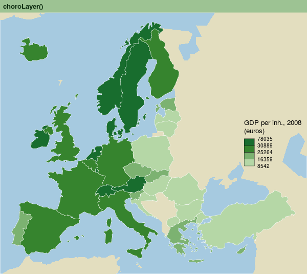

## Some simple maps

<small>

```{r choroPropS, echo=TRUE, eval=FALSE, prompt=FALSE, message=FALSE, results='hide'}
# save map
png(filename = "img/map3.png", width = 600, height = 535, res = 100)
par(mar = c(0,0,1.2,0))
# Plot a background layers
plot(nuts0.spdf, border = NA, col = NA, bg = "#A6CAE0")
plot(world.spdf, col = "#E3DEBF", border = NA, add = TRUE)

# Plot the gdp per inhabitant
choroLayer(spdf = nuts0.spdf, df = nuts0.df, var = "gdpinh", 
           col = carto.pal(pal1 = "sand.pal", 
                           n1 = 4), method = "quantile", 
           nclass = 4, border = "white", lwd = 0.5, 
           legend.pos = "right", 
           legend.title.txt = "GDP per inh., 2008\n(euros)", add = T)

# Plot the population
propSymbolsLayer(spdf = nuts0.spdf, df = nuts0.df, 
                 inches = 0.2, lwd = 1.25, 
                 var = "pop", col = NA, border = "#940000", 
                 legend.pos = "topright", legend.values.rnd = 0, 
                 legend.title.txt = 
                   "Population, 2008\n(thousands of inh.)", 
                 legend.frame = F)

# layout
layoutLayer(title = "propSymbolsLayer() + choroLayer()", 
            author = "Package cartography v1.4.2", 
            sources = "Source: Eurostat, 2011", 
            scale = NULL, theme = "sand.pal", 
            north = FALSE, frame = FALSE)
dev.off()


#                                                                                                         .

```

</small>

## Some simple maps

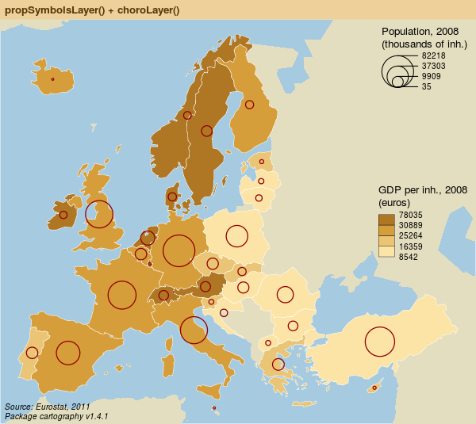

## Some simple maps

<small>

```{r propSchoro, echo=TRUE, eval=FALSE, prompt=FALSE, message=FALSE, results='hide'}
# save map
png(filename = "img/map4.png", width = 600, height = 535, res = 100)
par(mar = c(0,0,1.2,0))
# Plot a background layers
plot(nuts0.spdf, border = NA, col = NA, bg = "#A6CAE0")
plot(world.spdf, col = "#E3DEBF", border = NA, add = TRUE)
plot(nuts0.spdf, col = "#EAE797", border = "white", lwd = 0.5, 
     add = TRUE)

# Plot symbols with choropleth coloration
propSymbolsChoroLayer(spdf = nuts0.spdf, df = nuts0.df, 
                      var = "pop", inches = 0.3, 
                      var2 = "gdpinh", 
                      col = carto.pal(pal1 = "blue.pal", n1 = 4), 
                      symbols = "square", 
                      method = "quantile", nclass = 4, 
                      border = "grey50", 
                      lwd = 0.5, legend.var.pos = "topright", 
                      legend.var.values.rnd = 0, 
                      legend.var.style = "e", 
                      legend.var2.pos = "right", 
                      legend.var2.values.rnd = 0,
                      legend.var.title.txt = 
                        "Population, 2008\n(thousands of inh.)",
                      legend.var2.title.txt = 
                        "GDP per inh., 2008\n(euros)")


# layout
layoutLayer(title = "propSymbolsChoroLayer()", 
            author = "Package cartography v1.4.2", 
            sources = "Source: Eurostat, 2011",
            frame = FALSE, 
            theme = "blue.pal", scale = 500, north = FALSE)
dev.off()


#                                                                                                         .
```

</small>

## Some simple maps

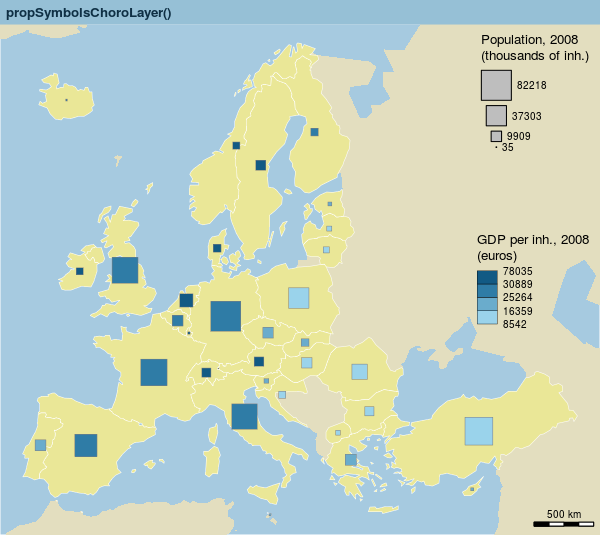

<div class="notes">
The three next maps are more complex. Their production involves
geo-processing operations, usually scattered across multiple steps and intermediate
files. cartography simplifies the process by wrapping all operations in its
functions.
</div>

## Gridded Map

<small>

```{r grid, echo=TRUE, eval=FALSE, prompt=FALSE, message=FALSE, results='hide'}
# Create a grid layer
mygrid <- getGridLayer(spdf = nuts3.spdf, cellsize = 1e+05, 
                       type = "hexagonal")
# Compute data for the grid layer
df1 <- getGridData(x = mygrid, df = nuts3.df, var = "pop2008")
df2 <- getGridData(x = mygrid, df = nuts3.df, var = "pop1999")

# Compute the compound annual growth rate
df1$cagr <- (((df1$pop2008/df2$pop1999)^(1/9)) - 1) * 100
v <- getBreaks(v = df1$cagr, method = "quantile", nclass = 10)
v[5] <- 0

# set a color palette
cols <- c("#f18b61", "#f7b48c", "#f3d9b7", "#f1eccd", 
          "#c0dec2", "#91caa4", "#63b285", "#329966", 
          "#26734d", "#1a4c33")


# save the map in png format
png(filename = "img/map5.png", width = 600, height = 535, res = 100)
par(mar = c(0, 0, 1.2, 0))

# Plot a background layers
plot(nuts0.spdf, border = NA, col = NA, bg = "#A6CAE0")
plot(world.spdf, col = "#CCCCCC", border = NA, add = TRUE)

# plot the choropleth grid
choroLayer(spdf = mygrid$spdf, df = df1, var = "cagr", add = TRUE, 
           col = cols, lwd = 0.6, border = "#FFFFFF60", 
           legend.pos = "right", breaks = v, legend.values.rnd = 2, 
           legend.title.txt = "Compound Annual\nGrowth Rate")

# plot countries boundaries
plot(nuts0.spdf, add = T, col = NA, border = "#56514c", lwd = 0.7)

# Plot a layout
layoutLayer(title = "Demographic Trends, 1999-2008", 
            author = "Package cartography v1.4.2", 
            sources = "Source: Eurostat, 2011", frame = TRUE, 
            scale = 500, north = TRUE, theme = "taupe.pal")
dev.off()


#                                                                                                         .
```


</small>

## Gridded Map

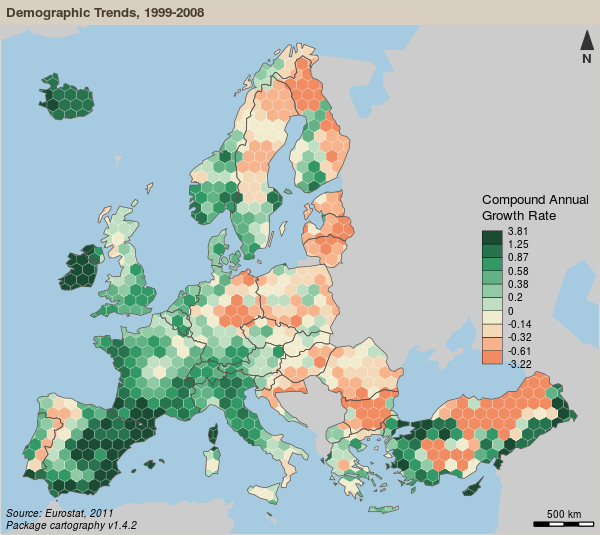

<div class="notes">
The “grid-cell” representation is a method that overcomes the arbitrariness and
irregularity of administrative divisions. It highlights the main spatial trends by
splitting the territory in regular blocks. Statistical values are distributed over a
regular grid. Cell values are calculated taking into account the share of intersected
areas between initial units and grid cells, and are eventually discretized and the grid
is displayed as a choropleth map.
In cartography, this process relies on three functions. getGridLayer
builds a regular grid (squares or hexagons) based on a spatial object and provides
the shares of intersected areas. getGridData computes data that matches the grid
layer. Finally, choroLayer displays the grid on a choropleth map.
</div>


## Discontinuities map

<small>
```{r disc, echo=TRUE, eval=FALSE, prompt=FALSE, message=FALSE, results='hide'}
# Get a SpatialLinesDataFrame of countries borders
nuts2.contig <- getBorders(nuts2.spdf)
nuts2.df$gdpcap <- nuts2.df$gdppps2008/nuts2.df$pop2008 * 1e+06

# save the map in png format
png(filename = "img/map6.png", width = 600, height = 535, res = 100)
par(mar = c(0, 0, 1.2, 0))

# Plot a background layers
plot(nuts2.spdf, border = NA, col = NA, bg = "#A6CAE0")
plot(world.spdf, col = "#E3DEBF", border = NA, add = TRUE)

# Plot GDP per capita with a choropleth layer
choroLayer(spdf = nuts2.spdf, df = nuts2.df, var = "gdpcap", 
           border = "grey20", lwd = 0.2, 
           col = carto.pal(pal1 = "green.pal", n1 = 3, "sand.pal", 3), 
           method = "quantile", nclass = 6, add = TRUE, 
           legend.pos = "right", legend.values.rnd = -2, 
           legend.title.txt = "GDP per Capita\n(in euros)")

# Plot discontinuities
discLayer(spdf = nuts2.contig, df = nuts2.df, 
          var = "gdpcap", type = "rel", 
          method = "equal", nclass = 3, threshold = 0.4, 
          sizemin = 0.7, sizemax = 6, col = "red", 
          legend.values.rnd = 1, legend.pos = "topright", add = TRUE,
          legend.title.txt = 
            "Discontinuities in \nGDP per Capita\n(relative)")

# Layout
layoutLayer(title = "Wealth Disparities in Europe, 2008", 
            author = "Package cartography v1.4.2", 
            sources = "Source: Eurostat, 2011", frame = TRUE, 
            scale = 500, north = FALSE, theme = "grey.pal")
dev.off()


#                                                                                                         .
```
</small>


## Discontinuities map

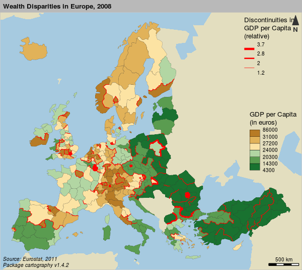

<div class="notes">
Discontinuity maps are based on the variation of a phenomenon in contiguous
administrative units. This kind of representation does not focus on homogeneous
regions, but rather on spatial breaks. Here, the thickness of the borders points out
discontinuities intensities.
The first step to build these maps is to extract borders from contiguous spatial
units. The second step is to compute a discontinuity measure (either a ratio or an
absolute difference). The third step consists in applying various values to borders’
thickness. Combining these discontinuities with a choropleth representation helps
understanding the discontinuity direction (which one of two regions records the
higher value).
In cartography, getBorders is used to extract borders between spatial
units. discLayer function computes and
displays discontinuities. A line’s width reflects the discontinuity level between two
neighboring units. The discontinuities layer can be supplemented by a choropleth
layer.
</div>


## Isopleth map

<small>
```{r smooth, echo=TRUE, eval=FALSE, prompt=FALSE, message=FALSE, results='hide'}
# Create a grid layer
mygrid <- getGridLayer(spdf = nuts3.spdf, cellsize = 50000, type = "regular")

# transform gdp in euros
nuts3.df$gdp <- nuts3.df$gdppps2008 * 1e+06
# Compute data for the grid layer
df1 <- getGridData(x = mygrid, df = nuts3.df, var = "pop2008")
df2 <- getGridData(x = mygrid, df = nuts3.df, var = "gdp")
df1$gdp <- df2$gdp

# list of breaks
v <- c(2920, 5000, 10000, 15000, 20000, 23500, 30000, 35000, 40000, 42720)

# save the map to a png file
# save the map in png format
png(filename = "img/map7.png", width = 600, height = 535, res = 100)
par(mar = c(0, 0, 1.2, 0))

# Plot a background layers
plot(nuts0.spdf, border = NA, col = NA, bg = "#A6CAE0")
plot(world.spdf, col = "#E3DEBF", border = NA, add = TRUE)

# set a color palette
cols <- c(rev(carto.pal("green.pal", 5)), carto.pal("orange.pal", 4))

# compute & display the potential map
smoothLayer(spdf = mygrid$spdf, df = df1, 
            var = "gdp", var2 = "pop2008", breaks = v, 
    span = 1e+05, beta = 2, mask = nuts0.spdf, 
    resolution = 49000, col = cols, 
    legend.title.txt = "Potential\nGDP per capita\n(in euros)", 
    legend.values.rnd = -2, 
    border = "grey80", lwd = 0.5, add = T, legend.pos = "topright")

# plot Europe contour
plot(rgeos::gBuffer(nuts0.spdf, FALSE, 1), add = T, col = NA, 
     border = "grey50")

# plot a layout
layoutLayer(title = "Wealth Inequalities in Europe, 2008", 
            author = "Package cartography v1.4.2", 
            sources = "Source: Eurostat, 2011", frame = TRUE, 
            scale = 500, north = FALSE, theme = "sand.pal")

# plot a text on the map
text(x = 6271272, y = 3600000, 
     labels = "Distance function:\n- type = exponential\n- beta = 2\n- span = 100 km", 
     cex = 0.8, adj = 0, font = 3)

dev.off()


#                                                                                                         .
```

</small>


## Isopleth map

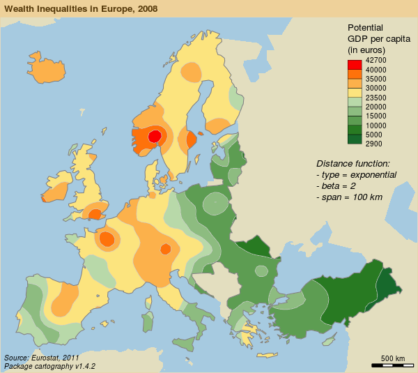

<div class="notes">
Unlike choropleth maps that imply a phenomenon is spatially discrete, isopleth
maps are based on the assumption that a phenomenon is spatially continuous. These
maps use a spatial interaction modeling approach aiming at computing indicators
based on stock values weighted by distances. This spatial representation is independent 
from the initial heterogeneity of the territorial division. The
result is easy to read and can be considered as a bypass of the Modifiable Areal Unit
Problem (MAUP).
In cartography the smoothLayer function, that heavily depends on
SpatialPosition, allows a quick computation
of these maps. The function takes a marked point layer and a set of parameters (a
spatial interaction function and its parameters) as inputs and displays an isopleth
map layer.
</div>

# Thank you

## Paper / Code / Slides

https://github.com/riatelab/ReproducibleCartography/


